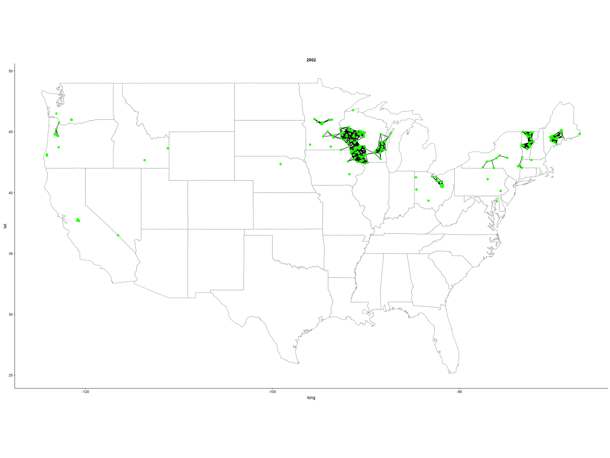
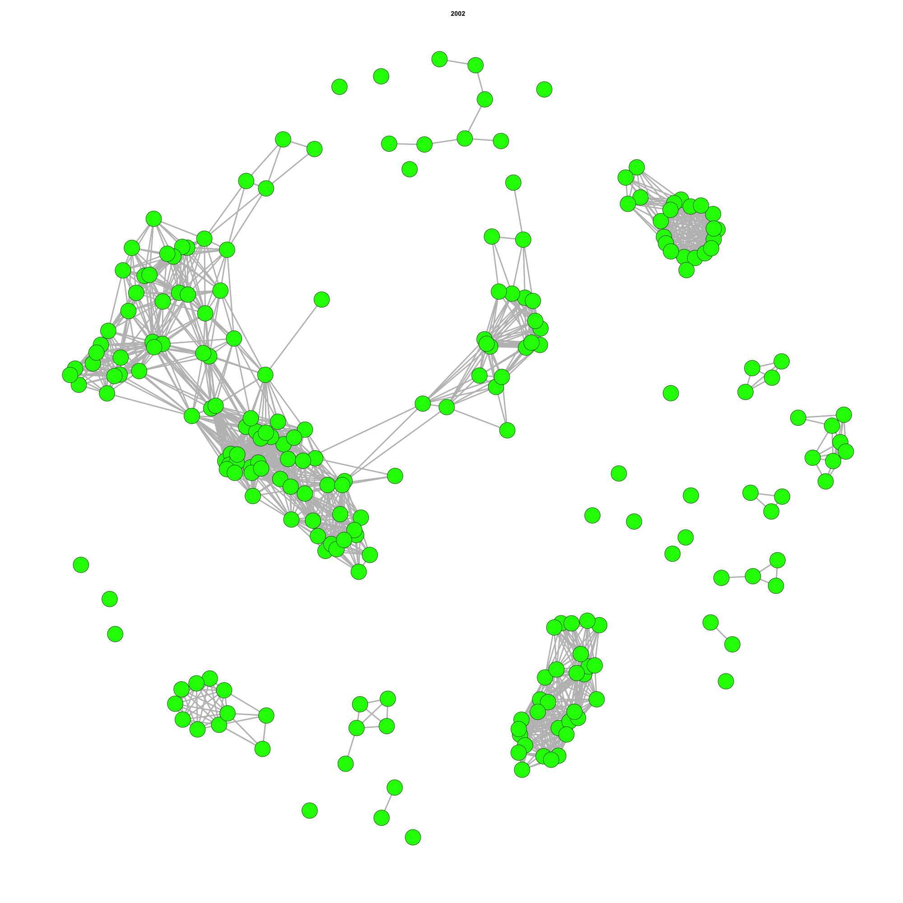

Dynamics of the U.S. Organic Dairy Farm Sector Since the Inception of the National Organic Standards
================
Juan C. S. Herrera, Carolyn Dimitri     
January, 2019

``` r
##############
#load libraries

  library(igraph)
  library(intergraph)
  library(tidyverse)
  library(RJSONIO)
  library(tinytex)
  library(ggplot2)
  library(cowplot)
  library(GGally)
  library(cowplot)
  library(RCurl)
  library(magick)
  library(readxl)
  library(RMySQL)
  library(reshape)
  library(network)
  library(statnet)
  library(gganimate)
  library(ggthemes)
  library(beepr) 
  library(sna)
  library(ggpubr)
```

Analysis
--------

1.  The data has been downloaded from <https://organic.ams.usda.gov/integrity/Reports/DataHistory.aspx> on June 8 2017. The specific download was "Data Submission Template Format: Operations/Scopes and Products on Separate Sheets" for 2016.

2.  Merging Operation and Item. The data was merged for both sheets operation level and item level. The merger keys used were x="op\_nopOpID", by.y="ci\_nopOpID" all.y = TRUE. This means that every observation in item nopOpID was kept, even withouth a matching record in x.

3.  Filtering data.

Livestock (Producers)
---------------------

-   United States Only
-   ci\_nopScope = LIVESTOCK
-   ci\_itemList contains milk, dairy or ci\_nopCatName milk, dairy (non case sensitive)

-   Since the data shows entries that are dated before 1992 before the certification happened, every date before 2002 was converted into 2002
-   The data is incomplete for 2016, therefore this year has been dropped.

``` r
#1. Import operation level
op <- read.csv("op.csv", stringsAsFactors = FALSE)
#2. Import item level
it <- read.csv("it.csv", stringsAsFactors = FALSE)

#3: Merge Operation and item levels
lsall<-merge(op, it, by.x="op_nopOpID", by.y="ci_nopOpID", all.y = TRUE)
#WRITE BACKUP CSV
write.csv(lsall, file = "lsall.csv", row.names = FALSE)
```

Getting GPS data:
-----------------

-   Create a vector concatenating the following fields: opPA\_line1 , opPA\_line2 , opPA\_city , opPA\_state , opPA\_country , opPA\_zip
-   Push this vector to Google Maps. Address: "<http://maps.google.com/maps/api/geocode/json?address>=" (Thie method is now deprecated starting June 2018. You will have to register for a google API: https://developers.google.com/maps/documentation/ and use your tokens)
-   Retrieve the first result's latitude and longitude.
-   You may need to register as a developer since the API has some restrictions on the number of queries that can be run per hour

``` r
#Create a function that collects the google data the source for this code is: https://stackoverflow.com/questions/32504880/street-address-to-geolocation-lat-long
#I have manually  tested this in order to make sure it works and use it for this paper
geocodeAdddress<- function(address) {
  require(RJSONIO)
  url <- "http://maps.google.com/maps/api/geocode/json?address="
  url <- URLencode(paste(url, address, "&sensor=false", sep = ""))
  x <- fromJSON(url, simplify = FALSE)
  if (x$status == "OK") {
    out <- c(x$results[[1]]$geometry$location$lng,
             x$results[[1]]$geometry$location$lat)
  } else {
    out <- matrix(nrow=2,ncol=1)
  }
  Sys.sleep(36)  # Sleep so you dont run over the limit of queries
  out
}
#Create vector with all the address values
lsall$opadresscom <- paste(lsall$opPA_line1 , lsall$opPA_line2 , lsall$opPA_city , lsall$opPA_state , lsall$opPA_country , lsall$opPA_zip, sep=" ")
#clean
lsall$opadfinal<-gsub("[^0-9\\.\\^A-Z\\^a-z\\ ]", "", lsall$opadresscom)
#Use function, get latitude and longitude from google maps
#You will need to re run this several times, excluding those for which you were able to get coordinates. Again, it is important to register for the google maps API so you don't run over the query limit. 
for(i in i:1000)
{
 lxxx <- paste(t(paste0(print(geocodeAdddress(lsall[i,59])))),sep="xxx")
  lxxx<-as.data.frame(t(lxxx))
  lxxx[1,3]<-paste(lxxx[1,1],lxxx[1,2],sep="xxx")
  lxxx
 lsall[i,60] <- (lxxx[1,3])
}
#write.csv(lsall, ".csv")
```

Load Previously Geo coded data
==============================

``` r
dairyp<-as.data.frame(read.csv("lsallUSAgeo.csv", header = TRUE, stringsAsFactors = FALSE, fileEncoding="latin1"))
conn <- dbConnect(RSQLite::SQLite(), dbname="organics.sqlite")
dbWriteTable(conn, value = dairyp, name = "dairygeoprod", overwrite = TRUE) 
dairypgeo<-dbGetQuery(conn, "
                        SELECT A. *
                        FROM dairygeoprod A
                        WHERE TRIM(A.ci_nopScope) IN ('LIVESTOCK')
                        AND   TRIM(A.opPA_country) IN ('United States of America (the)')
                        AND   ((TRIM(UPPER(A.ci_itemList)) LIKE ('%DAIRY%')
                        OR    TRIM(UPPER(A.ci_itemList)) LIKE ('%MILK%'))
                        OR    (TRIM(UPPER(A.ci_nopCatName)) LIKE ('%DAIRY%')
                        OR    TRIM(UPPER(A.ci_nopCatName)) LIKE ('%MILK%')))
                       ")
#get years from database for producers
dairypgeo$year<-as.numeric(as.character(substr(dairypgeo$op_statusEffectiveDate,(nchar(dairypgeo$op_statusEffectiveDate)+1)-4,nchar(dairypgeo$op_statusEffectiveDate))))
dairypgeo<-dairypgeo[dairypgeo$year <= 2015,]


#Unpack lat lon from data Google Geo Coded data
dairypgeo$lat<-sub(".*xxx", "", dairypgeo$geo)
dairypgeo$lon<-sub("xxx.*", "", dairypgeo$geo)
dairypgeo$lat<-sub(".*yyy", "", dairypgeo$lat)
dairypgeo$lon<-sub("yyy.*", "", dairypgeo$lon)

#check size of dataset: consistent: OK
#dim(dairypgeo)
```

Explore, describe the data
==========================

``` r
#get years from database for producers
dairypgeo$year<-as.numeric(as.character(substr(dairypgeo$op_statusEffectiveDate,(nchar(dairypgeo$op_statusEffectiveDate)+1)-4,nchar(dairypgeo$op_statusEffectiveDate))))
dairypgeo$year[dairypgeo$year <= 2002] <- 2002
dairypgeo<-dairypgeo[dairypgeo$year <= 2015,]

#check data loss: number of certifications with no GPS coordinates
dairypgeo$category<-NA
dairypgeo[dairypgeo$lat == "NA", "category"] <- c("No GPS")
dairypgeo[dairypgeo$lat != "NA" & dairypgeo$op_status != "Certified", "category"] <- c("Status =/= Certified")
dairypgeo[dairypgeo$lat != "NA" & dairypgeo$op_status == "Certified", "category"] <- c("GPS & Certified")

#Data Loss Plot
g<-ggplot(dairypgeo, aes(year, fill = category)) + 
  geom_bar() + scale_fill_manual("category", values = c("No GPS" = "red", "Status =/= Certified" = "blue", "GPS & Certified" = "gray")) +
  labs(x = "Year", y = "Number of Certifications") + theme_classic(base_size = 20) + theme(legend.position="top")

ncertifications <- paste(c("N = "),(as.character(length(dairypgeo$year))))

#Plot # 3: Unique producers who got at least one certification by year.
uniqueproducers<-as.data.frame(dairypgeo$op_nopOpID)
uniqueproducers$year<-dairypgeo$year
uniqueproducers$category<-dairypgeo$category

uniqueproducers<-unique(uniqueproducers)

g2<-ggplot(uniqueproducers, aes(year, fill = category)) + 
  geom_bar() + scale_fill_manual("category", values = c("No GPS" = "red", "Status =/= Certified" = "blue", "GPS & Certified" = "gray")) +
  labs(x = "Year", y = "Number of Producers") + theme_classic(base_size = 20) + theme(legend.position="top")
#g2 <- g2 + geom_text(stat='count', aes(label= ..count..), vjust = 0 ) labels?


#plot all
plot_grid(g, g2,nrow=2, labels=c("(a)","(b)"), align="hv", hjust = -54, vjust = 56, scale = 0.95)
```


``` r
ggsave("Figure 1.eps")
ggsave("Figure 1.jpg")
```

``` r
#Table number of certiciations per prroducer per year
for_g3<-uniqueproducers[uniqueproducers$category=="GPS & Certified",]
for_g3<-as.data.frame(table(for_g3$year))

for_g3_2<-dairypgeo[dairypgeo$category=="GPS & Certified",]
for_g3_2<-as.data.frame(table(for_g3_2$year))

for_g3$certifications<-for_g3_2$Freq
for_g3$average<-(for_g3$certifications/for_g3$Freq)


#Plot
ggplot(for_g3, aes(Var1, average)) +
  geom_col() +
  labs(title = "Mean certifications per Producer", x = "Year", y = "Certifications")
```


Certification Status (unit = certification, not firm)
-----------------------------------------------------

``` r
uniqueproducers3 <- as.data.frame(dairypgeo$op_nopOpID)
uniqueproducers3$op_status <- dairypgeo$op_status
uniqueproducers3 <- unique(uniqueproducers3)
table(uniqueproducers3$op_status)
```

    ## 
    ##   Certified Surrendered   Suspended 
    ##        2410          67          10

As the numbers are so small this variations are not considered for the first analysis. (This can be changed)

Connecting Producers and Handlers
---------------------------------

-   MxN matrix where *N*<sub>1</sub>, ..., *N*<sub>*n*</sub> = *p**r**o**d**u**c**e**r**s* and *M*<sub>1</sub>, ..., *M*<sub>*n*</sub> = *h**a**n**d**l**e**r**s*
-   Use Haversine distance to Calculate distance between each observation *M**N*
-   The Haversine distance formula in kilometers is:

*A**C**O**S*(*S**I**N*(*L**a**t*1)\**S**I**N*(*L**a**t*2)+*C**O**S*(*L**a**t*1)\**C**O**S*(*L**a**t*2)\**C**O**S*(*L**o**n*2 − *L**o**n*1)) \* 6371

Mapping Producers (57 producers that had at least one certification were not matched in the GPS data, therefore they are dropped from the analysis. N = 2433)

This has to be done for the case of dairy as the geodata was collected previous to all the filters
==================================================================================================

Inferring Social Networks based on geolocation
==============================================

Each producer that is located maximum 50 miles away (Euclidean distance) from another one will be connected. Everyone in this radus will be connected. We are assuming a perfect formation of social networks based on distance.

This assumed network relies on the fact that 50 miles should be a considerable distance to connect with other organic dairy producers.

Furthermore, those connections have been programed to be time dependent. The data has been divided in three chronological cuts. We assume that a producer in chrono 1 will only connect with a producer in chrono 1. A new entrant producer in chrono 2 will connect with the alrready established producers: chrono 1, or with the new entrants : chrono 2. For a new entrant in chrono 3 they will connect with the established producers: that is chrono 1 or 2, and the new entrants in chrono 3.

Warning:
========

The code below takes a long time to run. Depending on your system it can take up to 4 hours

``` r
#####################################################################
# Connect Producers year by year: new entrants     ###############
#####################################################################

### IMPORTANT IMPORTANT
#CLEANS: 
#  1 Only Certified
#  2. Only those with GPS Coordinates

producers<-dairypgeo[dairypgeo$category=="GPS & Certified",]
producers<-producers[producers$year <= 2015,]
producers$year[producers$year <= 2002] <- 2002
producers<-producers[,c("op_nopOpID","op_name","year","lat","lon")]
producers<-unique(producers)

#matrix to fill
tempdistances<-matrix(nrow=1, ncol=11) 
#dimensions of producers and handlers, makes sure that every produucer is matched with a handler
dimprod<-(as.matrix(dim(producers)))[1,1]
dimhandl<-(as.matrix(dim(producers)))[1,1]
table(producers$year)
colnames(producers)

# Calculates the geodesic distance between two points specified by radian latitude/longitude using the
deg2rad <- function(deg) return(deg*pi/180)
# Haversine formula (hf)
haversine <- function(long1, lat1, long2, lat2) {
  R <- 6371 # Earth mean radius [km]
  delta.long <- (long2 - long1)
  delta.lat <- (lat2 - lat1)
  a <- sin(delta.lat/2)^2 + cos(lat1) * cos(lat2) * sin(delta.long/2)^2
  c <- 2 * asin(min(1,sqrt(a)))
  d = R * c
  return(d) # Distance in km
}

for(i in 2002:2015)
{
  producersi<-producers[producers$year == i,]
  handlersi<-producers[producers$year <= i,]
  dimprod<-(as.matrix(dim(producersi)))[1,1]
  dimhandl<-(as.matrix(dim(handlersi)))[1,1]
  
  for(j in 1:dimprod)
  {
    for(k in 1:dimhandl)
    {
      #create matrix to populate with all calculated distances
      
      #calculate, populate, bring data for calculations: point pairs, point lat lon, distance calculated
      
      tempdistances[1,1]<-(as.numeric(producersi[j,1]))
      tempdistances[1,2]<-(as.numeric(handlersi[k,1]))
      tempdistances[1,3]<-(as.character(producersi[j,2]))
      tempdistances[1,4]<-(as.character(handlersi[k,2]))
      tempdistances[1,5]<-(as.numeric(producersi[j,3]))
      tempdistances[1,6]<-(as.numeric(handlersi[k,3]))
      
      tempdistances[1,7]<-(as.numeric(producersi[j,4]))
      tempdistances[1,8]<-(as.numeric(handlersi[k,4]))
      tempdistances[1,9]<-(as.numeric(producersi[j,5]))
      tempdistances[1,10]<-(as.numeric(handlersi[k,5]))
      
      tempdistances[1,11]<-(as.numeric(haversine(deg2rad(as.numeric(producersi[j,5])), 
                                                 deg2rad(as.numeric(producersi[j,4])), 
                                                 deg2rad(as.numeric(handlersi[k,5])), 
                                                 deg2rad(as.numeric(handlersi[k,4])))))
      if (k == 1)
      {
        distancesf<-tempdistances
      }
      if (k > 1)
      {
        distancesf<-rbind(distancesf,tempdistances)
      }
    }
    
    
    if (j == 1)
    {
      distancesff<-distancesf
    }
    if (k > 1)
    {
      distancesff<-rbind(distancesff,distancesf)
    }
    #distancesff<-distancesff[distancesff$p_dis_closest <= threshholdpercdist, ]
    #distancesff<-distancesff[distancesff$p_dis_closest > 1, ]
  }
  if (i == 2002)
  {
    distancesfff<-distancesff
  }
  if (i > 2002)
  {
    distancesfff<-rbind(distancesfff,distancesff)
  }
  print(i)
}


beep()
write.csv(distancesfff,"prod_prod_year.csv")
#remove(distancesfff, distancesf, distancesff)
distancesfff<-as.data.frame(distancesfff)

```

Mapping and Network Visualization
=================================

-   You can import the data from the previous steps here.

This code imports all connections. In this database every single producer is connected to another one. In the code I filter this to include only those producers connected with other ones within 50 miles around them or less.

Warning: Takes quite some time to run.

``` r
##Load Network
net<-read.csv("prod_prod_year.csv",stringsAsFactors = FALSE)
net <- net[net$V11 <= (50*1.6),] #Distance in kilometers, therefore the *1.6
net<-net[,c("V1","V2","V3","V4","V5","V6","V7","V8","V9","V10","V11")]
net<-unique(net)
x1<-as.data.frame(unique(net$V1))
x2<-as.data.frame(unique(net$V2))
names(x1)[names(x1)=="unique(net$V1)"] <- "xx"
names(x2)[names(x2)=="unique(net$V2)"] <- "xx"
x3<-rbind(x1,x2)
x3<-unique(x3)
```

``` r
remove(x1)
remove(x2)
remove(x3)

#Map Producer-Producer Chrono Geo-Static  
#net_map_s<-net[,c("V1","V3","V5","V7","V9","V11")]
#colnames(net_map_s) <- c("id", "name","year","lat","lon","dist")
#net_map_r<-net[,c("V2","V4","V6","V8","V10","V11")]
#colnames(net_map_r) <- c("id", "name","year","lat","lon","dist")
#net_map_s<-unique(net_map_s)
#net_map_r<-unique(net_map_r)
#net_map<-rbind(net_map_s,net_map_r)
#net_map$lat<-as.numeric(paste0(sub("[^0-9\\.]", "", net_map$lat)))
#net_map$lon<-as.numeric(paste0("-",sub("[^0-9\\.]", "", net_map$lon)))

#Map Producer-Producer Chrono Geo-NETWORK  
#get connections
dimforloop<-as.matrix(dim(net))[1,1]
connectingmap<-matrix(nrow=0, ncol=6) 
a<-matrix(nrow=1, ncol=6) 
b<-matrix(nrow=1, ncol=6) 

for(i in 1:dimforloop)
{
  a[1,1]<-net[i,9]
  a[1,2]<-net[i,7]
  a[1,3]<-i
  a[1,4]<-net[i,1]
  a[1,5]<-net[i,11]
  a[1,6]<-net[i,5]
  
  b[1,1]<-net[i,10]
  b[1,2]<-net[i,8]
  b[1,3]<-i
  b[1,4]<-net[i,2]
  b[1,5]<-net[i,11]
  b[1,6]<-net[i,6]
  
  connectingmap<-rbind(connectingmap,a,b)
  #print(i/dimforloop)
}
connectingmap<-as.data.frame(connectingmap)
colnames(connectingmap) <- c("lon", "lat","iteration","op_id","distance","year")
write.csv(connectingmap,"connectingmapnet.csv")
remove(connectingmap,a,b)
```

Create Maps (year by year)
=========================

The following code creates a map in which one can see how year by year each producer gets connected to another one. - The connections are made by connecting with other producers in a radius of 50 miles or less. - A producer that enters on a year x can only connect with producers that entered that same year or in the previous years.

``` r
# import so you dont have to re run
connectingmap<-read.csv("connectingmapnet.csv", stringsAsFactors = F)

uniquefordots<-as.data.frame(connectingmap$op_id)
colnames(uniquefordots)[1] <- "id"
uniquefordots$lon<-connectingmap$lon
uniquefordots$lat<-connectingmap$lat
uniquefordots$year<-connectingmap$year
uniquefordots<-unique(uniquefordots)

uniquefordots$id<-as.character(paste(uniquefordots$id,uniquefordots$year,sep="_"))

```

``` r
#Import USA map data
usa <- map_data("state")

#Create animated plot, this creates an animation with one frame per year.
theme_base(base_size = 200)
```

``` r
map <- ggplot() + 
  geom_polygon(data = usa, aes(x=long, y = lat, group = group), fill = "white", color = "#9fa9a3") + coord_fixed(1.3) #load USA map data

map <-map +  geom_path(data=connectingmap, aes(x=lon, y=lat, group = iteration, frame = year, cumulative = T), color="black", size=0.5)  # add edges

map <- map + geom_point(data = uniquefordots, aes(x = lon, y = lat, frame = year, cumulative = T), size = 3, color = "green") # add nodes

mapusaallstates <- map + geom_text(data = uniquefordots, aes(x = lon, y = lat, frame = year, cumulative = T, label=id), size = 2, color= "blue") #add node labels

#+geom_text(aes(label=uniquefordots$id),hjust=0, vjust=0)  #add nodes

 #create animation and export, for the whole USA
gganimate(map, interval = .3, interval = .3, ani.width= 2000, ani.height=1500, filename = "usamapall.gif")
```
Animated Map showing inferred networks at 100% probability of connecting in a. 50-mile radius
=========================


``` r
#create animation and export, for a selection of the Northeast, specifically the coordinates inside the paaremeters.
#these cordinates are centered on Organic Valley???s Distribution Center in the state of Wisconsin (coordinates 43.731517, -90.801919). The map shows +-2.5 lat and long around it

mapdetail <- map #+ geom_text(data = uniquefordots, aes(x = lon, y = lat, frame = year, cumulative = T, label=id), size = 4, color= "blue")
mapdetail <- mapdetail + coord_fixed(xlim = c(-93.301919,   -88.301919), ylim = c(41.231517, 46.231517))
 #add node labels

gganimate(mapdetail, interval = .3, ani.width= 2000, ani.height=1500, filename = 'detailnortheast.gif')
```

Animated Map showing inferred networks at 100% probability of connecting in a. 50-mile radius. Detail for the Northeast of the USA. Centered around Organic Valley???s Distribution Center in the state of Wisconsin
=========================


``` r
#saves map and mapdetails up to a certain year: 2005, 2010, 2015::::

#2005
usa <- map_data("state")
fig1tot<-connectingmap[connectingmap$year<=2005,]
theme_base(base_size = 200)
```

``` r
fig1fig <- ggplot() + geom_polygon(data = usa, aes(x=long, y = lat, group = group, label = "Fig 1"), fill = "white", color = "#9fa9a3") + coord_fixed(1.3) #load USA map data
fig1fig <- fig1fig + geom_path(data= fig1tot, aes(x=lon, y=lat, group = iteration), color="black", size=0.05)
fig1fig <- fig1fig + geom_point(data = fig1tot, aes(x = lon, y = lat), color = "green", size = 0.5) #add nodes
fig1fig <- fig1fig + theme_map()
fig1fig <- fig1fig + ggtitle(label = c("Simulated Organic Dairy Producer-Producer Network. 2002 - 2015"), subtitle = c("Figure 1. 2005           "))
#fig1fig
fig1fig2005<-fig1fig
ggsave("fig1_2005.eps")

#map detail
dev.off()
```

``` r
mapdetail<-fig1fig
mapdetail <- mapdetail + coord_fixed(xlim = c(-93.301919,   -88.301919), ylim = c(41.231517, 46.231517)) + theme_nothing()
mapdetail <- mapdetail + theme_map() + ggtitle(label = c("Detail Simulated Organic Dairy Producer-Producer Network. 2002 - 2015"), subtitle = c("Figure 1. 2005           "))
mapdetail
mapdetail2005<-mapdetail
ggsave("detailfig1_2005.eps")

remove(mapdetail,fig1fig)


#2010
usa <- map_data("state")
fig1tot<-connectingmap[connectingmap$year<=2010,]
theme_base(base_size = 200)
```

``` r
fig1fig <- ggplot() + geom_polygon(data = usa, aes(x=long, y = lat, group = group, label = "Fig 1"), fill = "white", color = "#9fa9a3") + coord_fixed(1.3) #load USA map data
fig1fig <- fig1fig + geom_path(data= fig1tot, aes(x=lon, y=lat, group = iteration), color="black", size=0.05)
fig1fig <- fig1fig + geom_point(data = fig1tot, aes(x = lon, y = lat), color = "green", size = 0.5) #add nodes
fig1fig <- fig1fig + theme_map()
fig1fig <- fig1fig + ggtitle(label = c("Simulated Organic Dairy Producer-Producer Network. 2002 - 2015"), subtitle = c("Figure 2. 2010           "))
fig1fig
fig1fig2010<-fig1fig
ggsave("fig1_2010.eps")

#map detail
dev.off()
```

``` r
mapdetail<-fig1fig
mapdetail <- mapdetail + coord_fixed(xlim = c(-93.301919,   -88.301919), ylim = c(41.231517, 46.231517)) + theme_nothing()
mapdetail <- mapdetail + theme_map() + ggtitle(label = c("Detail Simulated Organic Dairy Producer-Producer Network. 2002 - 2015"), subtitle = c("Figure 2. 2010           "))
mapdetail
ggsave("detailfig1_2010.eps")
mapdetail2010<-mapdetail
remove(mapdetail,fig1fig)

#2015
usa <- map_data("state")
fig1tot<-connectingmap[connectingmap$year<=2015,]
theme_base(base_size = 200)
```

``` r
fig1fig <- ggplot() + geom_polygon(data = usa, aes(x=long, y = lat, group = group, label = "Fig 1"), fill = "white", color = "#9fa9a3") + coord_fixed(1.3) #load USA map data
fig1fig <- fig1fig + geom_path(data= fig1tot, aes(x=lon, y=lat, group = iteration), color="black", size=0.05)
fig1fig <- fig1fig + geom_point(data = fig1tot, aes(x = lon, y = lat), color = "green", size = 0.5) #add nodes
fig1fig <- fig1fig + theme_map()
fig1fig <- fig1fig + ggtitle(label = c("Simulated Organic Dairy Producer-Producer Network. 2002 - 2015"), subtitle = c("Figure 3. 2015           "))
fig1fig
fig1fig2015<-fig1fig
ggsave("fig1_2015.eps")


#map detail
dev.off()
```

``` r
mapdetail<-fig1fig
mapdetail <- mapdetail + coord_fixed(xlim = c(-93.301919,   -88.301919), ylim = c(41.231517, 46.231517)) + theme_nothing()
mapdetail <- mapdetail + theme_map() + ggtitle(label = c("Detail Simulated Organic Dairy Producer-Producer Network. 2002 - 2015"), subtitle = c("Figure 1. 2015           "))
mapdetail
mapdetail2015<-mapdetail
ggsave("detailfig1_2015.eps")

remove(mapdetail,fig1fig)
```


Create Networks (year by year)
==============================

The following code creates a basic network visualizations depictinbg how producers connect to each other.

-   The location is used as an attribute to the edges. The variable has been inversely normalized from 0 to 1. In this case, the edge connecting two producers that are located 50 miles away from another one takes a value of 0, and those that are almost in the sale latitide and longitude takes a value of 1.

-   A producer that enters on a year x can only connect with producers that entered that same year or in the previous years.

``` r
#Getting plots of Networks
##Load data
net<-read.csv("prod_prod_year.csv",stringsAsFactors = FALSE)
net <- net[net$V11 <= (50*1.6),] #Distance in kilometers, therefore the *1.6
net<-net[,c("V1","V2","V3","V4","V5","V6","V7","V8","V9","V10","V11")]
colnames(net) <- c("from_id","to_id","name_s","name_r","year_s","year_r","lat_s","lat_r","lon_s","lon_r","distance")

#Normalize and invert distances 0 to 1. 1 is closer, 0 is far (50 miles)
net$z_distance <- 1 - ((net$distance - min(net$distance)) / (max(net$distance)-min(net$distance)))

#creates numbered id for loading the networks
```


``` r
x1<-as.data.frame(net[,c("from_id")])
colnames(x1)<-c("op_id")
x2<-as.data.frame(net[,c("to_id")])
colnames(x2)<-c("op_id")
x3<-as.data.frame(rbind(x1,x2))
x3<-as.data.frame(unique(x3))
x3$id<-seq.int(nrow(x3))

#subset the data to merge with new key
net_f<-net[,c("from_id","to_id","z_distance","year_s","year_r")]
net_f$from_id<-as.character(net_f$from_id)
net_f$to_id<-as.character(net_f$to_id)
net_f$year_s<-as.character(net_f$year_s)
net_f$year_r<-as.character(net_f$year_r)

#add row number (renames to and from so it can be loaded as a network. If the edges are not numbered and start with 1 then the network package may have problemt)
net_f<-merge(net_f, x3, by.x = "to_id" , by.y = "op_id")
names(net_f)[names(net_f) == 'id'] <- 'net_id_to'
net_f<-merge(net_f, x3, by.x = "from_id" , by.y = "op_id", sort = TRUE)
names(net_f)[names(net_f) == 'id'] <- 'net_id_from'
net_f<-net_f[,c("net_id_from","net_id_to","from_id","to_id","year_s","year_r","z_distance")]

#Plot showing the connections, by year
ggplot(net_f, aes(year_s, fill = year_r)) + 
  geom_bar() + scale_fill_manual("year_r", values = c("2002" = "grey0", "2003" = "grey5", "2004" = "grey10", "2005" = "grey15", "2006" = "grey20", "2007" = "grey23", "2008" = "grey27", "2009" = "grey35", "2010" = "grey40", "2011" = "grey50", "2012" = "grey55","2013" = "grey65", "2014" = "grey73", "2015" = "grey85")) +
  labs(title = "Inferred Networks. Sender - Edged by Chronology", x = "Count of edges by chronology (sender)", y = "Count of edges (receiver)") + theme_classic()
```


``` r
#Divides Networks by chronological times, based on sender.
#sender chrono 1 can send to chrono 1, sender chono 2 can send to chrono 2 and 1, sender chrono 3 can send to 1,2,3.
for (i in 2002:2015)
{
#subset and create data frames per year
#assign(paste0("chrono",i),as.data.frame(net_f[net_f$year_s == i,]))
#print(dim(eval(parse(text = paste0("chrono", i)))))

net_f1<-net_f[net_f$year_s == i,]
#dim(net_f1)
#find number of unique edges per network
x1<-as.data.frame(unique(net_f1$from_id)) 
x2<-as.data.frame(unique(net_f1$to_id))
names(x1)[names(x1)=="unique(net_f1$from_id)"] <- "xx"
names(x2)[names(x2)=="unique(net_f1$to_id)"] <- "xx"
x3<-rbind(x1,x2)
x3<-unique(x3)
dim(x1)
dim(x2)
dim(x3)
remove(x1)
remove(x2)
x3$id<-seq.int(nrow(x3))
net_f1<-merge(net_f1, x3, by.x = "from_id" , by.y = "xx", sort = T)
net_f1<-merge(net_f1, x3, by.x = "to_id" , by.y = "xx", sort = T)
net_f1<-net_f1[,c("id.x","id.y","to_id","from_id","z_distance","year_s","year_r")]
colnames(net_f1) <- c("net_id_from","net_id_to","from_id","to_id","z_distance","year_s","year_r")
net1dim<-as.data.frame(as.numeric(dim(x3)))[1,1] #get number of nodes, assign to variable for network construction
#remove(x3)
#isthiserror<-as.data.frame(net_f1[net_f1$net_id_to==c("9950004166"),])
#table(isthiserror$V5)

#build networks
yearNet1<-network.initialize(net1dim,loops=FALSE, directed = FALSE, bipartite = FALSE)
add.edges(yearNet1,net_f1[,1],net_f1[,2],
          names.eval=rep(list(list("to_id","from_id","z_distance","year_s","year_r")),nrow(net_f1)),
          vals.eval=lapply(1:nrow(net_f1),function(r){as.list(net_f1[r,3:7])}))
yearNet1

#Plot Networks
png(paste0(i,".png"), 2000, 2000)
plot.network(yearNet1,displaylabels = F, label=, main=i, edge.col = "gray", vertex.col = "green", mode="fruchtermanreingold")
dev.off()


assign(paste0("Netchrono",i),yearNet1)
#remove(net_f1,yearNet1)

}

system("convert -delay 80 *.png networks.gif")
```
Animated Map showing inferred networks at 100% probability of connecting in a. 50-mile radius. Network version, as opposed to maps.
=========================


``` r
pl1 <- fig1fig2005 + coord_map("albers", lat0=30, lat1=40)
```

    ## Coordinate system already present. Adding new coordinate system, which will replace the existing one.

``` r
pl2 <- fig1fig2010 + coord_map("albers", lat0=30, lat1=40)
```

    ## Coordinate system already present. Adding new coordinate system, which will replace the existing one.

``` r
pl3 <- fig1fig2015 + coord_map("albers", lat0=30, lat1=40)
```

    ## Coordinate system already present. Adding new coordinate system, which will replace the existing one.

``` r
netpl1 <- ggdraw() + draw_image('2005.png') + coord_fixed(ratio = 1)
netpl2 <- ggdraw() + draw_image('2010.png') + coord_fixed(ratio = 1)
netpl3 <- ggdraw() + draw_image('2015.png') + coord_fixed(ratio = 1)

plot_grid(plot_grid(pl1, labels=c("(a)"), hjust = -9, vjust = 25),
          plot_grid(netpl1, labels=c("(b)"), hjust = -3.5, vjust = 25), 
          rel_widths = c(1, 0.4))
```


``` r
ggsave("Figure 2 a b.eps")
```
``` r
ggsave("Figure 2 a b.jpg")
```

``` r
plot_grid(plot_grid(pl2, labels=c("(c)"), hjust = -9, vjust = 25),
          plot_grid(netpl2, labels=c("(d)"), hjust = -3.5, vjust = 25), 
          rel_widths = c(1, 0.4))
```


``` r
ggsave("Figure 2 c d.eps")
```

``` r
ggsave("Figure 2 c d.jpg")
```

``` r
plot_grid(plot_grid(pl3, labels=c("(e)"), hjust = -9, vjust = 25),
          plot_grid(netpl3, labels=c("(f)"), hjust = -3.5, vjust = 25), 
          rel_widths = c(1, 0.4))
```


``` r
ggsave("Figure 2 e f.eps")
```

``` r
ggsave("Figure 2 e f.jpg")
```

Network Analysis Statistics
===================================================================

Network Analysis Statistics with inferred networks at different levels of connection probability.
=================================================================================================

-   We selected several probabilities for forming a connection with producers arouns one another. At the lowest level (5%), we assume that a new producer only connects with 5 percent of the producers that are located in a 50 mile radius and have been certified on the same year or a previous year.

-   The different simulations have been made with 5% increments from 5 - 100.

-   The following network statistics were calculated for those simulated networks:

``` r
#Getting plots of Networks
##Load data
net<-read.csv("prod_prod_year.csv",stringsAsFactors = FALSE)
net <- net[net$V11 <= (50*1.6),] #Distance in kilometers, therefore the *1.6

net<-net[,c("V1","V2","V3","V4","V5","V6","V7","V8","V9","V10","V11")]
colnames(net) <- c("from_id","to_id","name_s","name_r","year_s","year_r","lat_s","lat_r","lon_s","lon_r","distance")
#Normalize and invert distances 0 to 1. 1 is closer, 0 is for (50 miles)
net$z_distance <- 1 - ((net$distance - min(net$distance)) / (max(net$distance)-min(net$distance)))

#creates numbered id for loading the networks
#head(net)
x1<-as.data.frame(net[,c("from_id")])
colnames(x1)<-c("op_id")
x2<-as.data.frame(net[,c("to_id")])
colnames(x2)<-c("op_id")
x3<-as.data.frame(rbind(x1,x2))
str(x3)
```

``` r
x3<-as.data.frame(unique(x3))
x3$id<-seq.int(nrow(x3))

#subset the data to merge with new key
net_f<-net[,c("from_id","to_id","z_distance","year_s","year_r")]
net_f$from_id<-as.character(net_f$from_id)
net_f$to_id<-as.character(net_f$to_id)
net_f$year_s<-as.character(net_f$year_s)
net_f$year_r<-as.character(net_f$year_r)

#add row number (renames to and from so it can be loaded as a network. If the edges are not numbered and start with 1 then the network package may have problemt)
net_f<-merge(net_f, x3, by.x = "to_id" , by.y = "op_id")
names(net_f)[names(net_f) == 'id'] <- 'net_id_to'
net_f<-merge(net_f, x3, by.x = "from_id" , by.y = "op_id", sort = TRUE)
names(net_f)[names(net_f) == 'id'] <- 'net_id_from'
net_f<-net_f[,c("net_id_from","net_id_to","from_id","to_id","year_s","year_r","z_distance")]
```

``` r
#removing some random edges: 20 iterations: from 5% connections in less than 50 miles, to 95% connections in less than 50 miles. 

loopuntil<-max(net_f$net_id_from)

for (j in seq(5, 100, 5)) 
{

  for (i in 1:loopuntil)
  {
    if (i == 1)
    {
      net_fsampled<-net_f[net_f$net_id_from == i,] #subsets, to get only one observation (one producer)
      net_fsampled<-net_fsampled[sample(nrow(net_fsampled), max((round(j/100 * nrow(net_fsampled))),1), replace = FALSE), ] #sample based on the desired percentage (parameter j)
      net_fsampled
    }
    if (i > 1)
    {
      net_fsampledb<-net_f[net_f$net_id_from == i,]
      if (nrow(net_fsampledb) >= 1)
      {
        
      net_fsampledb<-net_fsampledb[sample(nrow(net_fsampledb), (round(j/100 * nrow(net_fsampledb))), replace = FALSE), ]  
      net_fsampled<-rbind(net_fsampled,net_fsampledb)
      }

    }

  }
  
print(j)  
print(dim(net_fsampled))

av_path<-as.data.frame(matrix(nrow=14, ncol=3))
av_separation<-as.data.frame(matrix(nrow=14, ncol=3))
gtrans_time<-as.data.frame(matrix(nrow=14, ncol=3))
largest_cluster<-as.data.frame(matrix(nrow=14, ncol=3))
av_degree<-as.data.frame(matrix(nrow=14, ncol=3))

for (k in 2002:2015)
{
#subset and create data frames per year
#assign(paste0("chrono",i),as.data.frame(net_f[net_f$year_s == i,]))
#print(dim(eval(parse(text = paste0("chrono", i)))))

net_f1<-net_fsampled[net_fsampled$year_s == k,]
dim(net_f1)

#find number of unique edges per network
x1<-as.data.frame(unique(net_f1$from_id)) 
x2<-as.data.frame(unique(net_f1$to_id))
names(x1)[names(x1)=="unique(net_f1$from_id)"] <- "xx"
names(x2)[names(x2)=="unique(net_f1$to_id)"] <- "xx"
x3<-rbind(x1,x2)
x3<-unique(x3)
dim(x1)
dim(x2)
dim(x3)
remove(x1)
remove(x2)
x3$id<-seq.int(nrow(x3))
net_f1<-merge(net_f1, x3, by.x = "from_id" , by.y = "xx", sort = T)
net_f1<-merge(net_f1, x3, by.x = "to_id" , by.y = "xx", sort = T)
net_f1<-net_f1[,c("id.x","id.y","to_id","from_id","z_distance","year_s","year_r")]
colnames(net_f1) <- c("net_id_from","net_id_to","from_id","to_id","z_distance","year_s","year_r")
net1dim<-as.data.frame(as.numeric(dim(x3)))[1,1] #get number of nodes, assign to variable for network construction
remove(x3)

#build networks
yearNet1<-network.initialize(net1dim,loops=FALSE, directed = FALSE, bipartite = FALSE)
add.edges(yearNet1,net_f1[,1],net_f1[,2],
          names.eval=rep(list(list("to_id","from_id","z_distance","year_s","year_r")),nrow(net_f1)),
          vals.eval=lapply(1:nrow(net_f1),function(r){as.list(net_f1[r,3:7])}))
yearNet1


#Average Shortest Path
library(igraph)
yearNet1igraph<-asIgraph(yearNet1)
clos1 <- average.path.length(yearNet1igraph, directed=FALSE, unconnected=TRUE)
av_path[k-2001,1]<-as.numeric(j)
av_path[k-2001,2]<-as.numeric(k)
av_path[k-2001,3]<-as.numeric(mean(clos1))
colnames(av_path) <- c("perc","year","av_sh_path")
remove(clos1)
detach("package:igraph", unload=TRUE)

#Average separation
clos1 <- closeness(yearNet1,cmode="suminvundir")
av_separation[k-2001,1]<-as.numeric(j)
av_separation[k-2001,2]<-as.numeric(k)
av_separation[k-2001,3]<-as.numeric(mean(clos1))
colnames(av_separation) <- c("perc","year","av_separation")
remove(clos1)

#Transtitivity

clos1 <- gtrans(yearNet1, mode = "graph", use.adjacency = T, measure = "correlation")
gtrans_time[k-2001,1]<-as.numeric(j)
gtrans_time[k-2001,2]<-as.numeric(k)
gtrans_time[k-2001,3]<-as.numeric(mean(clos1))
colnames(gtrans_time) <- c("perc","year","gtrans_time")
remove(clos1)

#Largest Cluster
clos1 <- component.largest(yearNet1, connected="weak")
largest_cluster[k-2001,1]<-as.numeric(j)
largest_cluster[k-2001,2]<-as.numeric(k)
largest_cluster[k-2001,3]<-as.data.frame(table(clos1))[2,2]/(as.data.frame(table(clos1))[2,2]+as.data.frame(table(clos1))[1,2])
colnames(largest_cluster) <- c("perc","year","largest_cluster")
remove(clos1)

component.largest

#Average degree

degree1<-degree(yearNet1,diag=F,rescale = F)
av_degree[k-2001,1]<-as.numeric(j)
av_degree[k-2001,2]<-as.numeric(k)
av_degree[k-2001,3]<-mean(degree1)
colnames(av_degree) <-c("perc","year","average_degree")
remove(degree1)

}
remove(net_f1,yearNet1)

#collects tables
  if (j == 5)
  {
    av_path_f<-av_path
    av_separation_f<-av_separation
    gtrans_time_f<-gtrans_time
    largest_cluster_f<-largest_cluster
    av_degree_f<-av_degree
  }
  if (j > 5)
  {
   av_path_f<-rbind(av_path_f,av_path)
   av_separation_f<-rbind(av_separation_f,av_separation)
   gtrans_time_f<-rbind(gtrans_time_f,gtrans_time)
   largest_cluster_f<-rbind(largest_cluster_f,largest_cluster)
   av_degree_f<-rbind(av_degree_f,av_degree)
  }
}
```

``` r
ggplot(av_path_f, aes(year, av_sh_path, group = perc)) + 
  geom_line(aes(colour=perc, group=perc)) + labs(title = "Average Shortest Path", x = "year", y = "Av. Shortest Path") + theme_classic()
```


``` r
ggsave("av_shortestpath.jpg", plot = last_plot(), width = 6, height = 3, units = "in")
ggsave("av_shortestpath.eps")
```


``` r
ggplot(av_separation_f, aes(year, av_separation, group = perc)) + geom_line(aes(colour=perc, group=perc)) + labs(title = "Closeness", x = "year", y = "Closeness") + theme_classic()
```


``` r
ggsave("Closeness.jpg", plot = last_plot(), width = 6, height = 3, units = "in")
ggsave("Closeness.eps")
```

``` r
ggplot(gtrans_time_f, aes(year, gtrans_time, group = perc)) + geom_line(aes(colour=perc, group=perc)) + labs(title = "Clustering coefficient", x = "year", y = "Clustering coefficient") + theme_classic()
```


``` r
ggsave("Clustering_coefficient.jpg", plot = last_plot(), width = 6, height = 3, units = "in")
ggsave("Clustering_coefficient.eps")
```

``` r
ggplot(largest_cluster_f, aes(year, largest_cluster, group = perc)) + geom_line(aes(colour=perc, group=perc)) + labs(title = "Largest Cluster", x = "year", y = "Relative size of largest cluster") + theme_classic()
```


``` r
ggsave("Largest_Cluster.jpg", plot = last_plot(), width = 6, height = 3, units = "in")
ggsave("Largest_Cluster.eps")
```

``` r
ggplot(av_degree_f, aes(year, average_degree, group = perc)) + geom_line(aes(colour=perc, group=perc)) + labs(title = "Average Degree", x = "year", y = "Average Degree") + theme_classic()
```


``` r
ggsave("Average_Degree.jpg", plot = last_plot(), width = 6, height = 3, units = "in")
ggsave("Average_Degree.eps")
```


``` r
beep()
```
